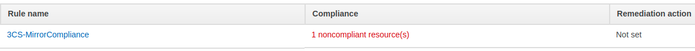
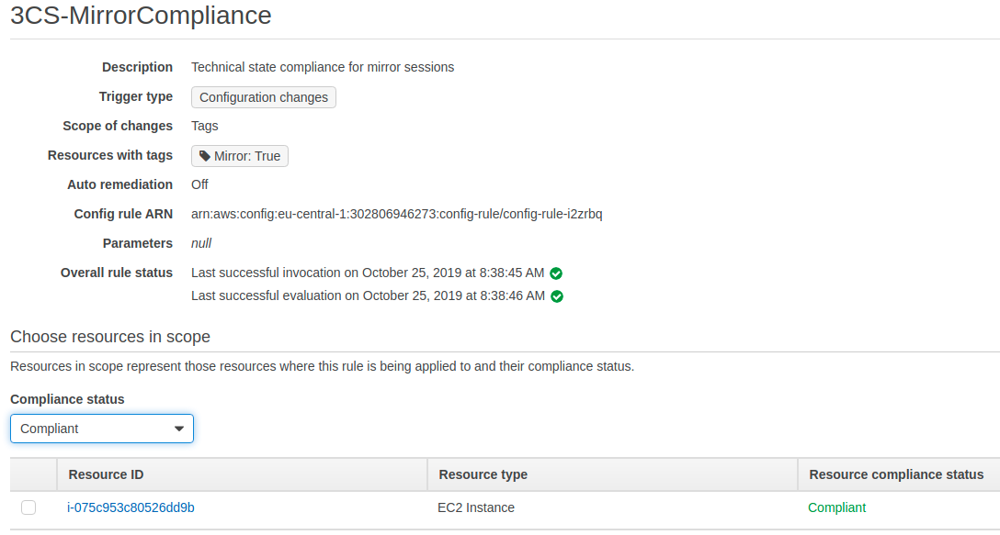
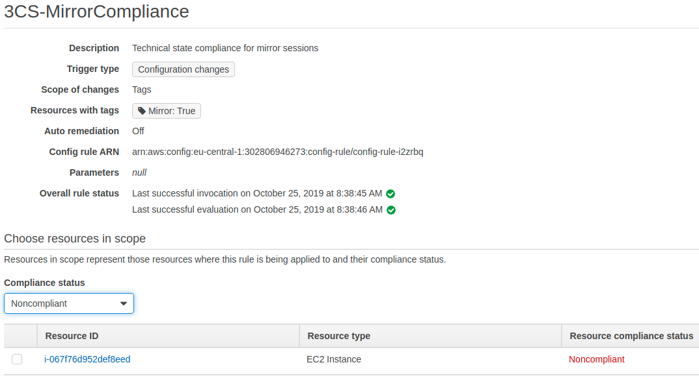

# AWS Config - Mirror Session
Check compliance of EC2 instances for Session Mirroring

# AWS Config
Part of the [AWS Mirror Toolkit](https://github.com/3CORESec/aws-mirror-toolkit), this AWS Config rule is meant to check compliance of session mirroring sessions against individual network interfaces. It assumes that a Session Mirror Target exists.

## 3CS AWS Mirror Toolkit
This project is developed to work alongside [AutoMirror](https://github.com/3CORESec/AWS-AutoMirror). If you'd like to use it separately, make sure to adjust the configuration of the rule accordingly. 

# Installation

* Create an [Execution Policy](./IAM/Lambda-ExecutionRole-Policy.json) for the Lambda
* Deploy the Lambda function [code](./Code/index.js) in a Node.js 10 environment.
* Create a custom AWS Config rule following the example of [this image](./Imgs/ConfigConfig.png) and point at the previously deployed Lambda function

# Compliance Results

Instances that have a network interface for which a session mirroring session exists *(NetworkInterfaceId)* are considered **COMPLIANT**:

Instances for which no session mirroring sessions exists with their network interface *(NetworkInterfaceId)* are considered **NOT COMPLIANT**:

To reduce false positives we've created a third compliance state, **NOT APPLICABLE**. This is the result that is given to Amazon-owned resources. This applies, for example, to NAT Gateways, since they hold a network interface but configuration for session mirroring is not possible.

# Feedback
Found this interesting? Have a question/comment/request? Let us know! 

Feel free to open an [issue](https://github.com/3CORESec/aws-config-mirrorsession/issues) or ping us on [Twitter](https://twitter.com/3CORESec).
